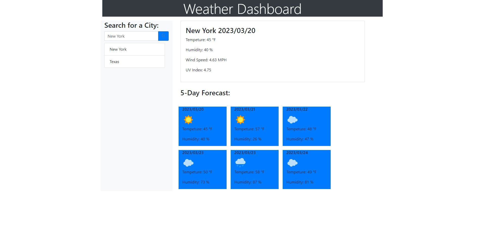

# WeatherTracker

Link to deployed repo:

https://justinbugarin.github.io/WeatherTracker/

Description:

Allows the user to view a city's current weather and the next 5 day weather forecast.

after searching for the city it goes to the history which allows the user to click back on it instead of searching it again

Screenshots

